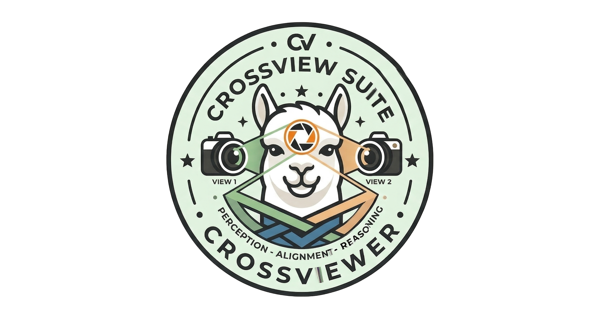
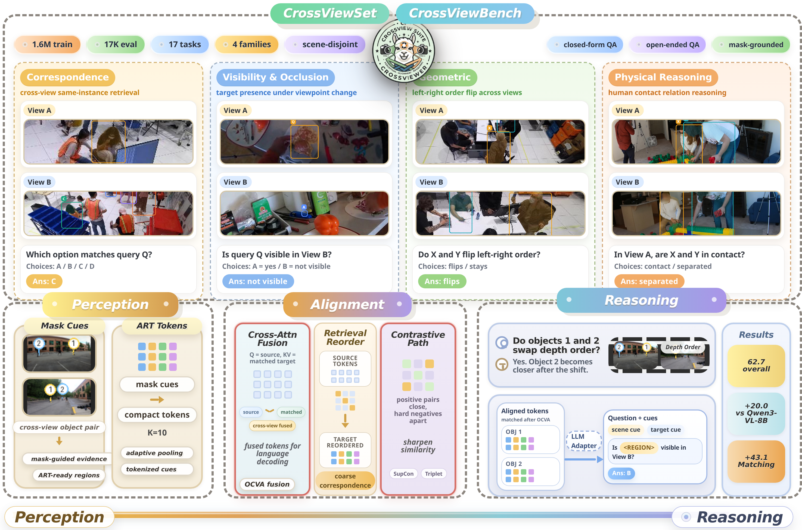
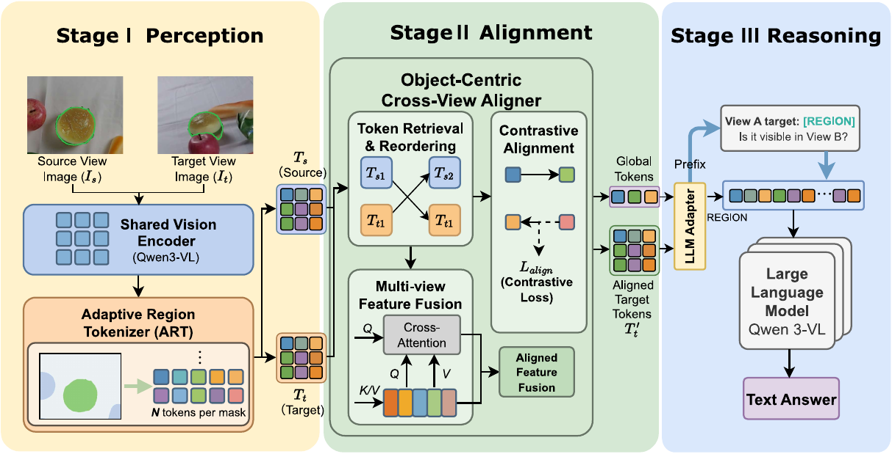
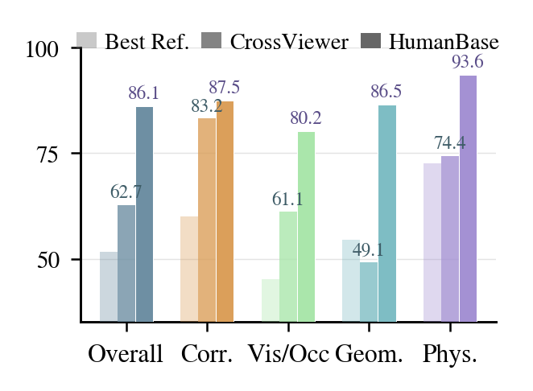
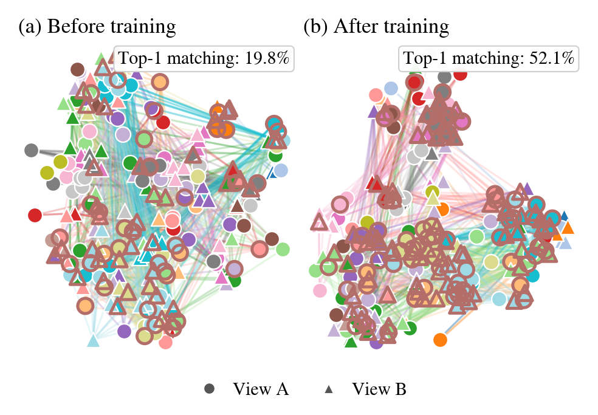

# CrossView Suite

**Boosting cross-view spatial intelligence of MLLMs with dataset, benchmark, and model design.**

Python 3.10+ | PyTorch 2.0+ | Qwen3-VL backbone | CrossViewer code available

[Overview](#overview) | [Architecture](#architecture) | [Results](#results) | [Repository](#repository) | [Quick Start](#quick-start)



## Overview

CrossView Suite targets cross-view spatial intelligence for multimodal large language models. Instead of treating multi-view understanding as generic multi-image fusion, it organizes the problem around object correspondence, visibility, geometry, and physical reasoning across viewpoints.

The project is structured around three coordinated components:

| Component | Role | Paper signal | Release status |
| --- | --- | --- | --- |
| `CrossViewSet` | Large-scale cross-view instruction data with mask grounding and object-level supervision | `1.6M` training samples | Suite-level release can be added under this repository later |
| `CrossViewBench` | Scene-disjoint benchmark for correspondence, visibility, geometry, and physical reasoning | `17K` questions across `17` task types | Benchmark assets can be added under this repository later |
| `CrossViewer` | Object-centric multi-view reasoning framework | Qwen3-VL-based training and evaluation pipeline | Available now in [`CrossViewer/`](CrossViewer) |

> Current public snapshot: this repository mainly contains the `CrossViewer/` model code, configs, and training or evaluation scripts.

## Architecture



CrossViewer follows a progressive pipeline from perception to alignment to reasoning:

- `ART` converts mask-grounded objects into compact object tokens.
- `OCVA` performs explicit cross-view token retrieval, reordering, and alignment.
- The aligned object representation is injected into Qwen3-VL for answer generation.

This repository includes the model implementation, ablations, and configs for default training, Hungarian matching, and global fusion variants.

## Results



Gap to the strongest reference and HumanBase.



Q1 correspondence embeddings before and after training.

### Table 3 Highlights

Selected rows from Table 3 in the paper:

| Model | Overall | Corr. | Vis/Occ | Geometric | Physical |
| --- | ---: | ---: | ---: | ---: | ---: |
| HumanBase | 86.1 | 87.5 | 80.2 | 86.5 | 93.6 |
| Gemini-3.1-Pro | 51.5 | 60.0 | 39.0 | 50.5 | 56.0 |
| GPT-5.2 | 49.5 | 41.5 | 45.1 | 54.5 | 58.3 |
| Qwen3.5-397B | 51.7 | 50.1 | 41.0 | 54.1 | 72.6 |
| Qwen3-VL-8B | 42.7 | 40.1 | 30.7 | 45.3 | 71.1 |
| **CrossViewer (ours)** | **62.7** | **83.2** | **61.1** | 49.1 | **74.4** |

## Repository

```text
Crossview-Suite/
├── README.md
├── docs/
│   └── assets/
└── CrossViewer/
    ├── configs/          # training configs and ablation settings
    ├── crossviewer/      # model definition and core modules
    ├── data/             # JSONL dataset loader and mask/object utilities
    ├── scripts/          # training and evaluation entrypoints
    ├── run_train.sh
    ├── run_train_nohup.sh
    └── requirements.txt
```

Key entrypoints:

- Training: [`CrossViewer/scripts/train.py`](CrossViewer/scripts/train.py)
- Evaluation: [`CrossViewer/scripts/eval_mc.py`](CrossViewer/scripts/eval_mc.py)
- Default config: [`CrossViewer/configs/default.yaml`](CrossViewer/configs/default.yaml)

## Quick Start

### Installation

```bash
cd CrossViewer
pip install -r requirements.txt
pip install decord
# optional for large-scale training
pip install deepspeed
```

### Train

```bash
cd CrossViewer
torchrun --nproc_per_node=4 --master_port=12355 scripts/train.py --config configs/default.yaml
```

### Evaluate

```bash
cd CrossViewer
python scripts/eval_mc.py --config configs/default.yaml --ckpt /path/to/checkpoint
```

## Configuration

All key paths live in `CrossViewer/configs/*.yaml`. Required input paths are intentionally left empty in this upload-friendly version, and path fields are resolved relative to each YAML file.

| Field | Required | Description |
| --- | --- | --- |
| `model.vision_encoder_path` | Yes | Local Qwen3-VL checkpoint path or model identifier |
| `data.data_root` | Yes | Dataset root used to resolve sample assets |
| `data.jsonl_train` | Train | Training annotation JSONL |
| `data.jsonl_val` | Val / Eval | Validation annotation JSONL |
| `training.save_dir` | Recommended | Checkpoint output directory |
| `training.log_dir` | Recommended | Logging directory |

## Status

- `CrossViewer` model code is available in this repository.
- Dataset and benchmark packaging for the full suite can be added later.
- Citation metadata can be finalized when the paper release is finalized.
