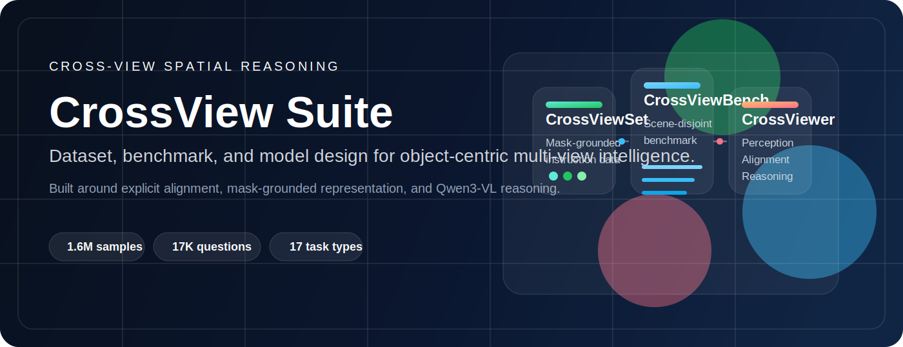
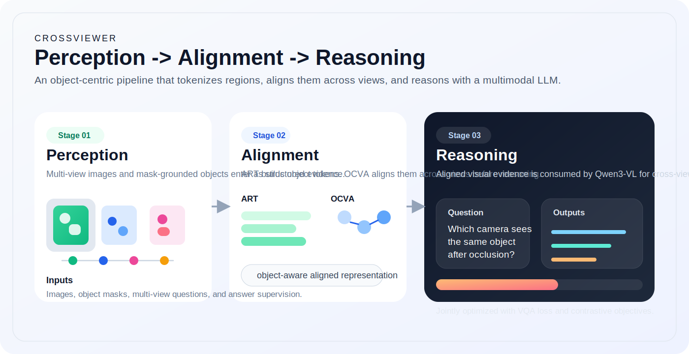

<p align="center">
  
</p>

<h1 align="center">CrossView Suite</h1>

<p align="center">
  <strong>Boosting cross-view spatial intelligence of MLLMs with dataset, benchmark, and model design.</strong>
</p>

<p align="center">
  
  
  
  
  
</p>

<p align="center">
  <a href="#overview">Overview</a> |
  <a href="#crossviewer">CrossViewer</a> |
  <a href="#repository">Repository</a> |
  <a href="#quick-start">Quick Start</a> |
  <a href="#configuration">Configuration</a> |
  <a href="#status">Status</a>
</p>

> Current public snapshot: this repository primarily contains the `CrossViewer/` model code and training and evaluation pipeline. Suite-level dataset and benchmark assets can be added here as the release expands.

## Overview

CrossView Suite targets a hard gap in multimodal reasoning: understanding the same scene across viewpoints, visibility changes, geometry shifts, and object correspondence. The project is organized as a coordinated suite with data, benchmark, and model components rather than a single model-only release.

| Component | Purpose | Signal in the paper | Repository status |
| --- | --- | --- | --- |
| `CrossViewSet` | Large-scale cross-view instruction data with mask grounding and object-level supervision | `1.6M` training samples | Suite-level release can be added under this repository later |
| `CrossViewBench` | Scene-disjoint benchmark for correspondence, visibility, geometry, and physical reasoning | `17K` questions across `17` task types | Benchmark assets can be added under this repository later |
| `CrossViewer` | Progressive perception -> alignment -> reasoning framework for object-centric multi-view reasoning | Qwen3-VL-based reasoning pipeline | Available now in [`CrossViewer/`](./CrossViewer) |

<p align="center">
  
</p>

## CrossViewer

CrossViewer turns multi-view perception into object-level reasoning. Instead of relying only on implicit multi-image fusion, it builds explicit object representations, aligns them across views, and then reasons with a multimodal LLM.

| Module | Role | Why it matters |
| --- | --- | --- |
| `ART` | Adaptive Region Tokenizer for mask-grounded object tokenization | Preserves object-level evidence instead of collapsing all views into a single visual stream |
| `OCVA` | Object-Centric Cross-View Aligner | Performs explicit cross-view alignment before downstream reasoning |
| `GlobalMultiViewFusion` | Global fusion variant used in comparison settings | Supports ablations and broader fusion baselines |
| `Qwen3-VL` backbone | Vision-language reasoning backbone | Drives answer generation after alignment-aware perception |

### Highlights

- Explicit object-level cross-view alignment rather than purely implicit fusion
- Mask-grounded visual representation for fine-grained multi-view reasoning
- Training and evaluation pipeline built around Qwen3-VL
- Baseline, ablation, Hungarian matching, and global-fusion configurations in `configs/`
- Relative config path resolution, avoiding machine-specific absolute paths in scripts

## Repository

```text
Crossview-Suite/
├── README.md
├── docs/
│   └── assets/
│       ├── crossview-suite-banner.svg
│       └── crossviewer-pipeline.svg
└── CrossViewer/
    ├── configs/          # training configs and ablation settings
    ├── crossviewer/      # model definition and core modules
    ├── data/             # JSONL dataset loader and mask/object utilities
    ├── scripts/          # training and evaluation entrypoints
    ├── run_train.sh
    ├── run_train_nohup.sh
    └── requirements.txt
```

### What is available now

- Full `CrossViewer` model implementation
- Training entrypoint: [`CrossViewer/scripts/train.py`](./CrossViewer/scripts/train.py)
- Multiple-choice evaluation entrypoint: [`CrossViewer/scripts/eval_mc.py`](./CrossViewer/scripts/eval_mc.py)
- Configs for default training, global fusion, Hungarian matching, and ablations

## Quick Start

### Installation

```bash
cd CrossViewer
pip install -r requirements.txt
pip install decord
# optional for large-scale training
pip install deepspeed
```

### Train

```bash
cd CrossViewer
torchrun --nproc_per_node=4 --master_port=12355 scripts/train.py --config configs/default.yaml
```

### Evaluate

```bash
cd CrossViewer
python scripts/eval_mc.py --config configs/default.yaml --ckpt /path/to/checkpoint
```

## Configuration

All key paths are configured in `CrossViewer/configs/*.yaml`. Required input paths are intentionally left empty in this upload-friendly version, and path fields are resolved relative to each YAML file.

| Field | Required | Description |
| --- | --- | --- |
| `model.vision_encoder_path` | Yes | Local Qwen3-VL checkpoint path or model identifier |
| `data.data_root` | Yes | Dataset root used to resolve sample assets |
| `data.jsonl_train` | Train | Training annotation JSONL |
| `data.jsonl_val` | Val / Eval | Validation annotation JSONL |
| `training.save_dir` | Recommended | Checkpoint output directory |
| `training.log_dir` | Recommended | Logging directory |

Minimal setup flow:

1. Fill in the required paths in your chosen config under [`CrossViewer/configs/`](./CrossViewer/configs).
2. Confirm the Qwen3-VL checkpoint and JSONL annotations are reachable from your environment.
3. Launch training or evaluation from the [`CrossViewer/`](./CrossViewer) directory.

## Data

The current data loader is centered on JSONL annotations and supports:

- multi-view samples stored in JSONL format
- per-view images and object masks
- inline COCO-style RLE masks
- object-centric question answering supervision

This release is structured so that model code can be used immediately, while larger suite-level assets can be organized into the same repository later.

## Status

| Area | Status |
| --- | --- |
| `CrossViewer` model code | Available |
| Training pipeline | Available |
| Evaluation pipeline | Available |
| Suite-level dataset packaging | Can be added later |
| Suite-level benchmark packaging | Can be added later |
| Citation metadata | To be finalized with paper release |

## Citation

Citation metadata can be added once the paper release is finalized.
